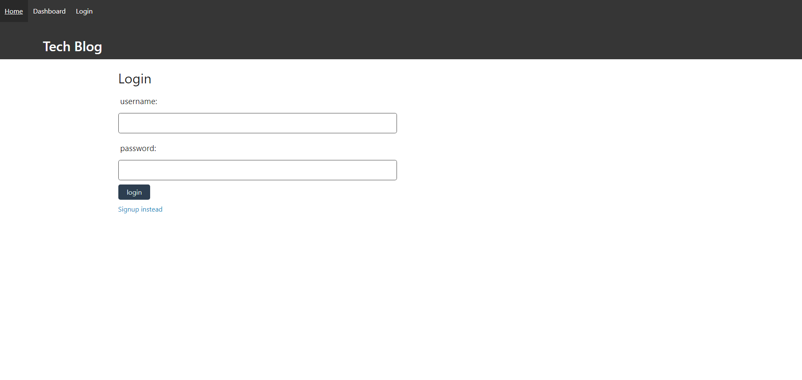
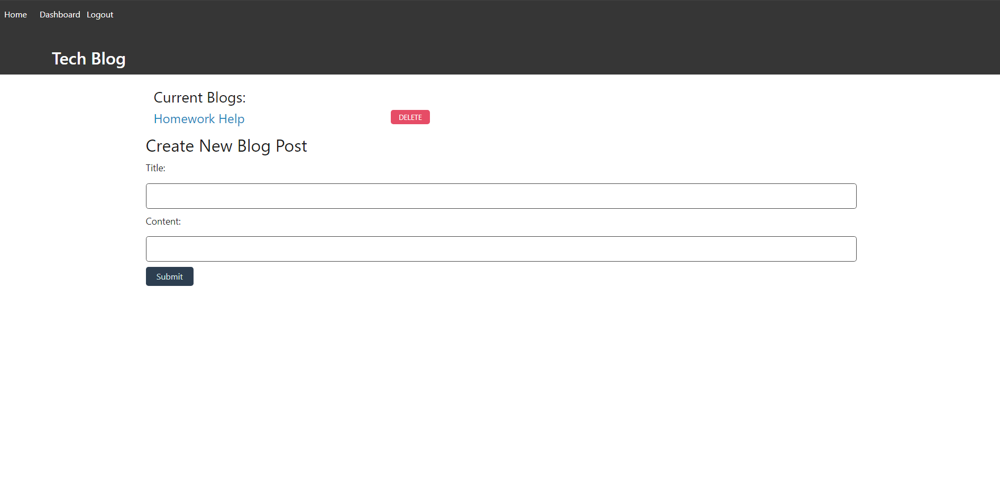
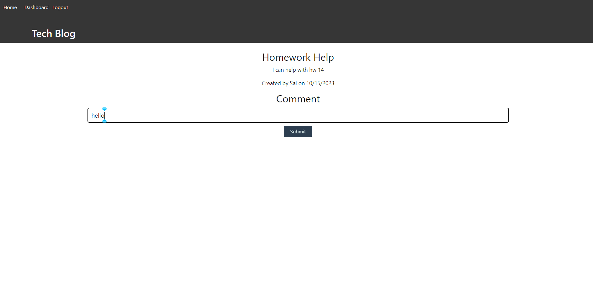
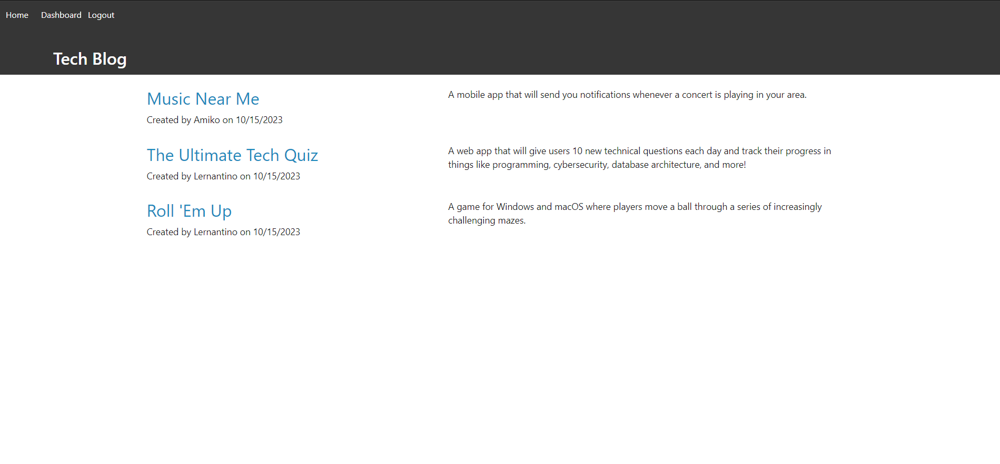

# ECommerce

## Description
A full-stack web application for users to post blogs on hot tech topics! Join the community by signing up for an account and posting your first tech blog. Engage with other users by commenting on their posts, and browsing recent posts on the homepage. 

## Table of Contents 

- [Installation](#installation)
- [Usage](#usage)
- [Credits](#credits)
- [License](#license)

## Installation

You can access this project by clicking the following link: https://github.com/TheRealMi/ECommerce

## Usage

Sign up or login to your existing account to create a new tech blog post. 

View any posts you have created on your dashboard.
You can also delete blog posts from your dashboard. 

Add comments to blog posts once you are signed in. 

View recent blog posts on the homepage. 

Watch the video below to see a walkthrough of the application:
<a href="https://watch.screencastify.com/v/Y8I7TWvAehYGcMhSfeZ4">CLICK ME!</a>

## Credits

[Coding Bootcamp](https://courses.bootcampspot.com)

[Professor Phil Loy](https://github.com/philliploy)

[w3 Schools](https://www.w3schools.com/)

## License

Please refer to the license on the repo